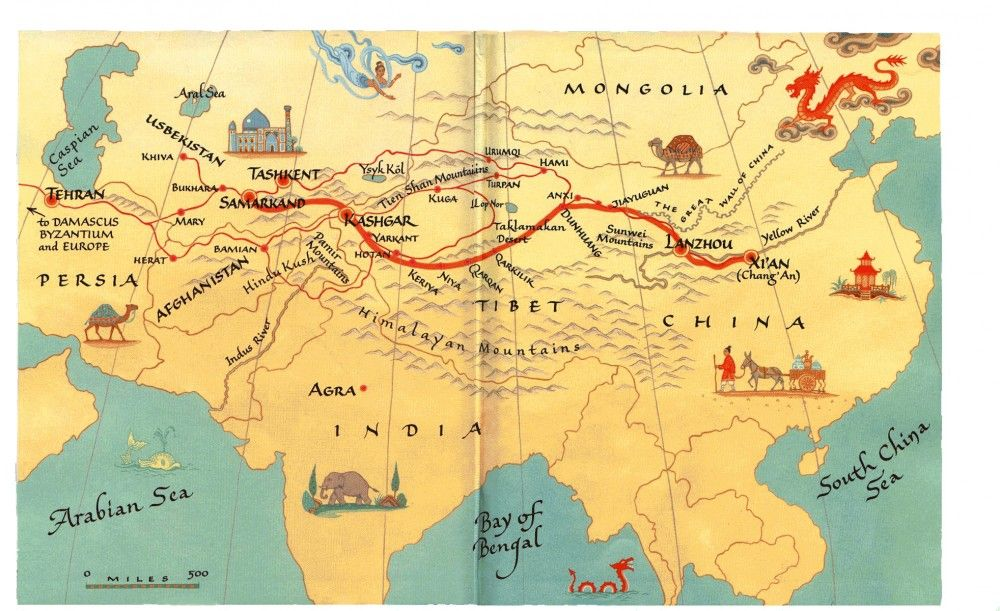
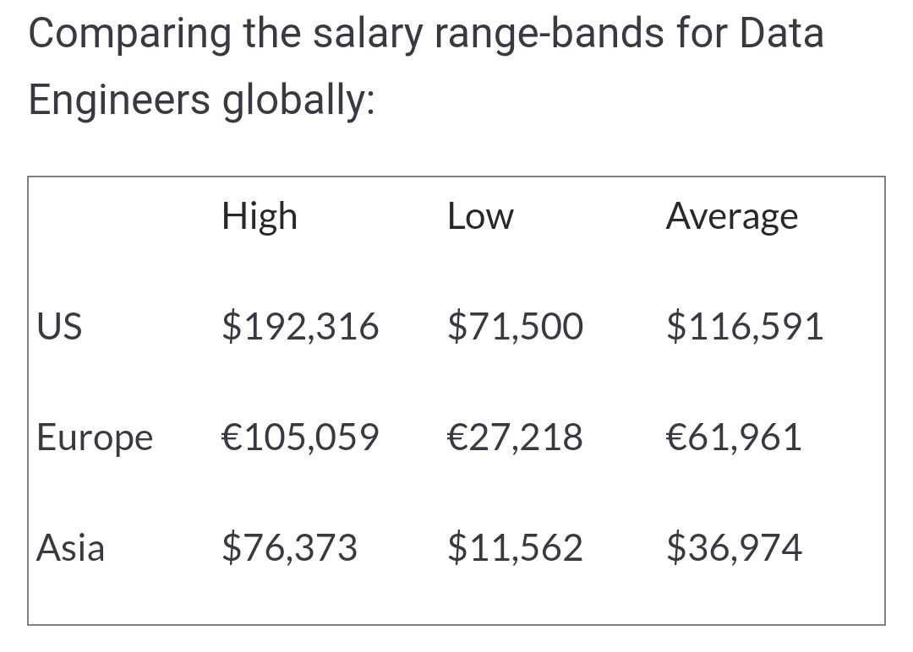

The United States and China are fiercely competing in AI and biotech. These technologies are increasingly strategic post Covid-19.

Debates often focus on head-to-head comparisons between the two giants, in terms of scientific output or economic investments. On the other hand, third-party countries tend to be overlooked, although they represent the remaining 77% of the world population.

However, to replace the USA as the first global superpower, China is betting on the Belt and Road Initiative  (一带一路), an international trade project, and foreign policy vision, reaching out to the rest of the world. BRI revives the old silk roads that brought glory to China in the past:

  

  

In the modern version, the New Silk Road expands over large parts of the globe:

  

  

  

The first phase of the project, estimated at 8 Trillion US Dollars, is deploying new infrastructures : roads, railways and seaports.

  
  
  
  
 

  

  

However, the project doesn't stop there. There's also a **digital silk road** for tech infrastructures: 5G, optic-fiber cables, and data centers.

  

  

Likewise, there's a **health silk road**  (健康丝绸之路), rising with the pandemic, which involves masks, vaccines, and their clinical trials.

  

However, those initiatives mostly involve large companies: Huawei, AliBaba, SinoPharm and CanSino. Belt and Road initiatives involving smaller players still remain in their infancy.

China didn't elaborate a strong **Startup Silk Road**, or **Venture Capital Silk Road** yet, although they could be key ingredients to achieve AI and biotech supremacy faster.

  

To fill this gap, we launched **ChingHub**  ([www.chinghub.com](https://chinghub.com/)), a platform connecting +1000 investors from China to deep tech startups around the world.

  

We are initially focusing on building a **precision medicine silk road**, at the intersection of AI and biotech. We are sourcing deals globally  (including within the United States).

  

Go to [ChingHub.com](https://chinghub.com/) to submit a project, or join as an investor.

  
  

  

  

## Chinese Silk Road vs US brain drain

A silk road approach can disrupt US dominance in AI and biotech. Several analysts identify inflow of top talent  (i.e. brain drain) as America's best asset for preserving supremacy  (see  [here](https://www.belfercenter.org/publication/china-beating-us-ai-supremacy) and [here](https://www.foreignaffairs.com/articles/united-states/2020-06-19/china-wont-win-race-ai-dominance)). Their idea is that while China can mobilise the largest population, with 1.5 billion people, the US can recruit talent from all 7.7 billion people on Earth, and pick the best and the brightest.

  

For example, we can see that [US affiliations still largely dominate](https://macropolo.org/digital-projects/the-global-ai-talent-tracker/) accepted papers at the NeurIPS AI conference, a rough metric for top-20% quality of AI research:

  

However, most of this US talent comes from abroad, and ironically, the biggest source is China!

   

  

By looking at talent flows, we can see this brain drain mostly happens at the graduate school level:

  

  

  

Undergrad students around the world get into US grad schools for mainly two reasons:

-   **funding** their PhD
-   getting a US **work permit** after graduation

  

Access to the US job market remains in high demand because the pay gap with the rest of the world is huge:

  

  

To dislodge the United States on the premium talent market, China can design appropriate **incentives**. By investing within the Mainland, and along silk roads, China can dry brain drain at the source. Talent will have less reasons to move to America, when Chinese money improve local opportunities. Instead of the US brain drain model, China can propose an alternative **brain exchange** model, maximizing **tech transfers** to the Mainland.

  

Moreover, to improve the quality of their deal flow, Chinese investors can benefit from online education and distance learning. Nowadays, it's no longer necessary to move to Stanford to receive a Stanford education. That's why our ChingHub platform includes an **online grad school**, to incubate new projects.

  

The American approach to technology remain very local and territorial. For example, a Silicon Valley VC will often be reluctant to deal with a startup just based in the Eastern part of San Francisco Bay. Likewise, our American competitor in immuno-oncology, the Parker Institute for Cancer Immunotherapy, restricts funding to a [few established US institutions](https://www.parkerici.org/network/research-institutions/).

  

On the other hand, the Chinese approach is more **scalable**. It can leverage various silk roads to find the next big thing, even deep into the African continent, like AliBaba founder Jack Ma did in his Africa's Business Heroes show:

  <iframe  style="margin:0 auto;" src="https://www.youtube.com/embed/rZQXbxkooTo" frameborder="0" allow="accelerometer; autoplay; encrypted-media; gyroscope; picture-in-picture" allowfullscreen></iframe>

  

In an industry like precision oncology, being more **inclusive** can provide a competitive advantage over  American elitism, because patient enrollment is often the bottleneck that slows down clinical research.

China already used this health silk road when facing Covid-19 patient shortage in the Mainland, by testing vaccines abroad in Indonesia or Brazil. This valuable experience can be expanded to other areas, like precision oncology.

  

Here is a table summarizing differences between ChingHub and its American counterpart PICI:

  

Will the pandemic be a wake-up call for America, to reinvent itself and challenge China's emerging leadership on the global arena? Future will tell.

